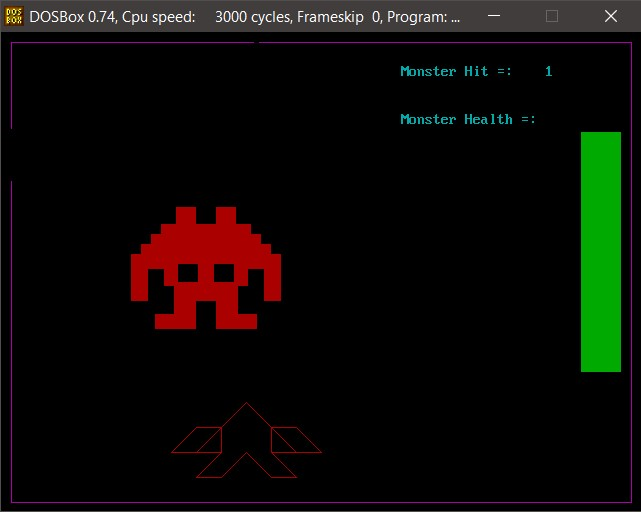

# Alien-Shooter
An alien shooter game made in  <strong> MASM 8086 <strong> during the learning process of BS CS degree at Fast NUCES Islamabad.

## Requirements

- DOSBOX is required to run this project
- all.inc contains all the helpful macros
- Respective levels are named with the filenames
- Each level is in a different file

## Run following commands

- Run DosBox and type `mount c c:\8086`
- `masm filename.asm`
- `link filename`
- `filename`

## Screenshot

